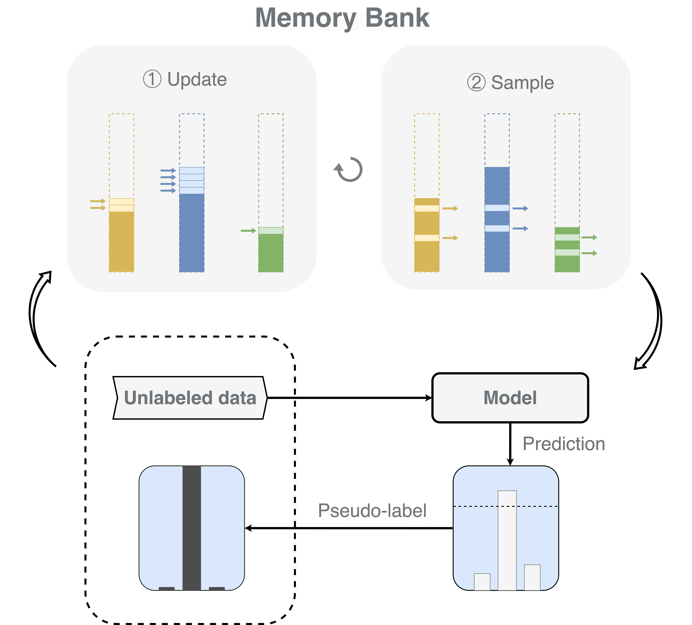

# DeCrisisMB: Debiased Semi-Supervised Learning for Crisis Tweet Classification via Memory Bank

<!--  -->
<div align="center">
  
</div>

This repository contains the implementation of the paper:
> **DeCrisisMB: Debiased Semi-Supervised Learning for Crisis Tweet Classification via Memory Bank**
> [[Paper]](https://aclanthology.org/2023.findings-emnlp.406.pdf) [[OpenReview]](https://openreview.net/forum?id=du1t38uXPA) [[ACL Anthology]](https://aclanthology.org/2023.findings-emnlp.406/) [[arXiv]](https://arxiv.org/abs/2310.14577) <br>
> Findings of the Association for Computational Linguistics: EMNLP 2023 <br>
> Henry Peng Zou, Yue Zhou, Weizhi Zhang, Cornelia Caragea <br>


## Setup
### Install Package 
```bash
conda create -n decrisis python=3.8 -y
conda activate decrisis

# install pytorch
conda install pytorch==1.12.1 torchvision==0.13.1 torchaudio==0.12.1 -c pytorch

# install dependency
pip install -r requirements.txt
```
### Data Preparation
All data is included in this repository. The file structure should look like:

```bash
DeCrisis/
    |-- data/
        |-- hurricane
        |-- threecrises
        |-- ag_news
            |-- train.csv
            |-- val.csv
            |-- test.csv
            ......
    |-- models
    |-- utils
    |-- main.py
    |-- panel_main.py 
    ......
```

## Reproduce Paper Results

To reproduce our main paper results, simply run: 
```bash
python panel_main.py
python panel_threecrises.py
```

To reproduce our out-of-domain results, simply run:
```bash
python panel_ODomain.py
```
Specify the log location and model saving location if you need, e.g., log_home = './experiment/hurricane' in panel_main.py and output_dir_path = './experiment/hurricane' in main.py. 


## Bugs or Questions

If you have any questions related to the code or the paper, feel free to email Henry Peng Zou (pzou3@uic.edu). If you encounter any problems when using the code, or want to report a bug, you can open an issue. Please try to specify the problem with details so we can help you better and quicker!


## Citation
If you find this repository helpful, please consider citing our paper 💕: 
```bibtex
@inproceedings{zou2023decrisismb,
  title={DeCrisisMB: Debiased Semi-Supervised Learning for Crisis Tweet Classification via Memory Bank},
  author={Zou, Henry and Zhou, Yue and Zhang, Weizhi and Caragea, Cornelia},
  booktitle={Findings of the Association for Computational Linguistics: EMNLP 2023},
  pages={6104--6115},
  year={2023}
}

@inproceedings{zou2023jointmatch,
  title={JointMatch: A Unified Approach for Diverse and Collaborative Pseudo-Labeling to Semi-Supervised Text Classification},
  author={Zou, Henry and Caragea, Cornelia},
  booktitle={Proceedings of the 2023 Conference on Empirical Methods in Natural Language Processing},
  pages={7290--7301},
  year={2023}
}
```

## Acknowledgement
This repo borrows some data and codes from [DebiasPL](https://github.com/frank-xwang/debiased-pseudo-labeling) and [USB](https://github.com/microsoft/Semi-supervised-learning). We appreciate their great works.
